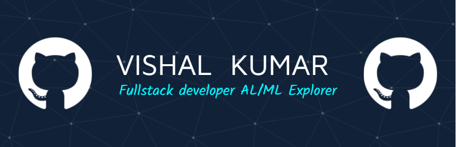
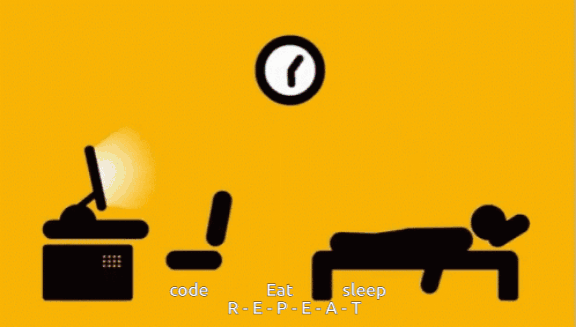

<!-- Heading -->

<h1 align="center">Hi 👋, I'm VISHAL KUMAR</h1>
<h3 align="center">A passionate Data science Engineer</h3>
<!-- 
  
 -->

-  Internship in ISM DHANBAD (Image based Crack-Detection uing Machine Learning)
- 🌱 **Nodejs + Explore Deep Learning**

- 💬 Ask me about **Machine Learning + DSA + C++**

- 📫 How to reach me **vishal31ku@gmail.com**
<!--  connect WITH ME-->
<h3 align="left">Connect with me:</h3>

<!--  Languages and Tools -->
<h3 align="left">Languages and Tools:</h3>

                

<!-- STATS ME-->

  

  

